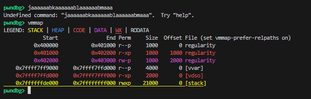
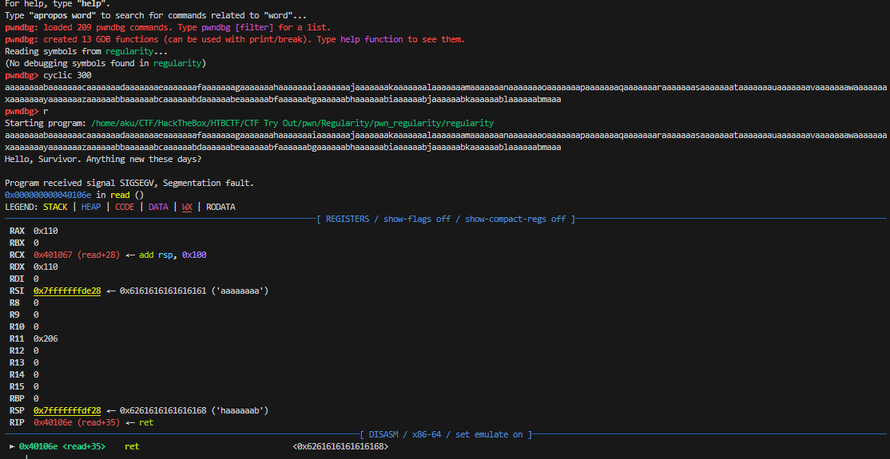
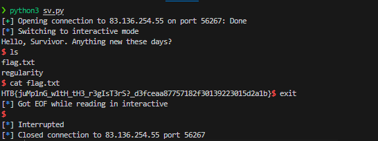

# Regularity

This is just an easy challenge PWN on HackThebox, but i got a bit confused for a moment in this challenge

At first glance, we can see that `rsp` allocates 0x100 (256) byte for the buffer. but this program can read up to 0x110 (272) byte.This can potentially allow us to execute a buffer overflow and overwrite the return address.

If we check `vmmap` in `pwngdb` it`ll be show us if the stack have a full permission.So, in this case we can store our shellcode to the stack.

 When i try to overwrite and find the offset , its seemed interesting. the `rsi` register is point to our buffer input, so we can use this for our payload.Since we don't know where the stack is, we can use an assembly gadget to jump there. We can use `jmp rsi` gadget and we`ll jump to there,allowing us to execute our shellcode on the stack

[solver](sv.py)